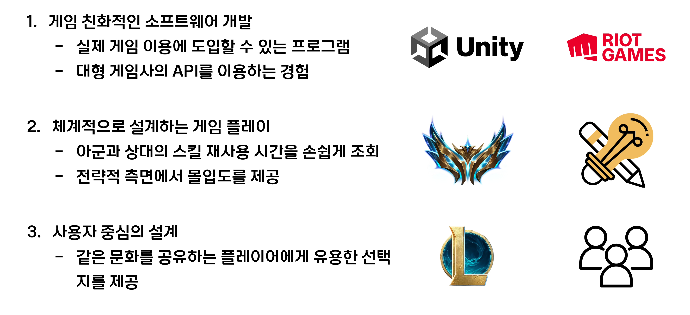
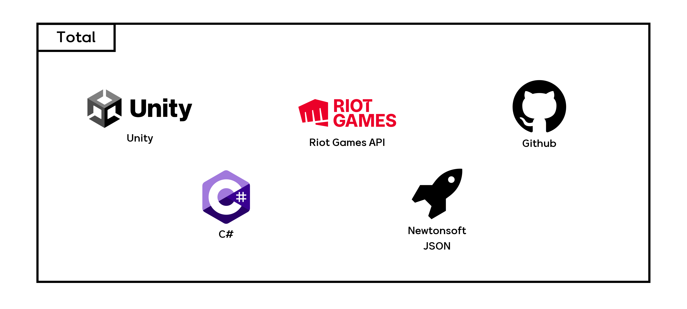
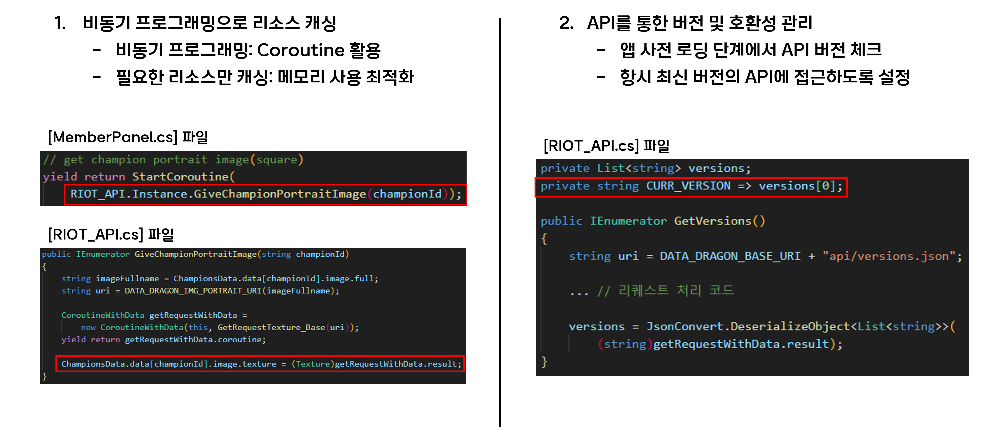
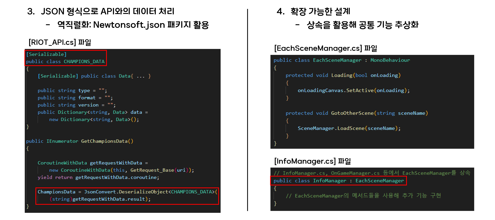
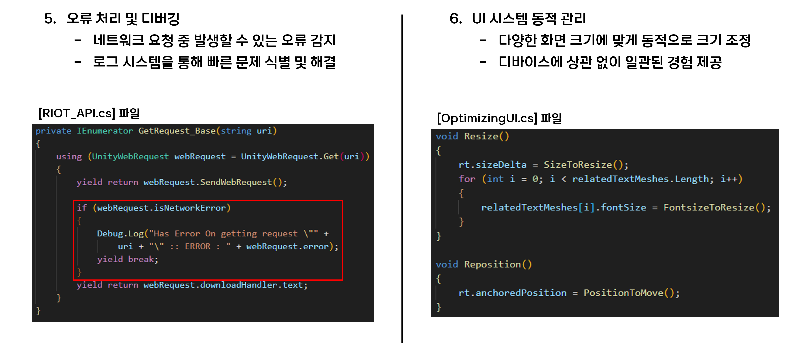
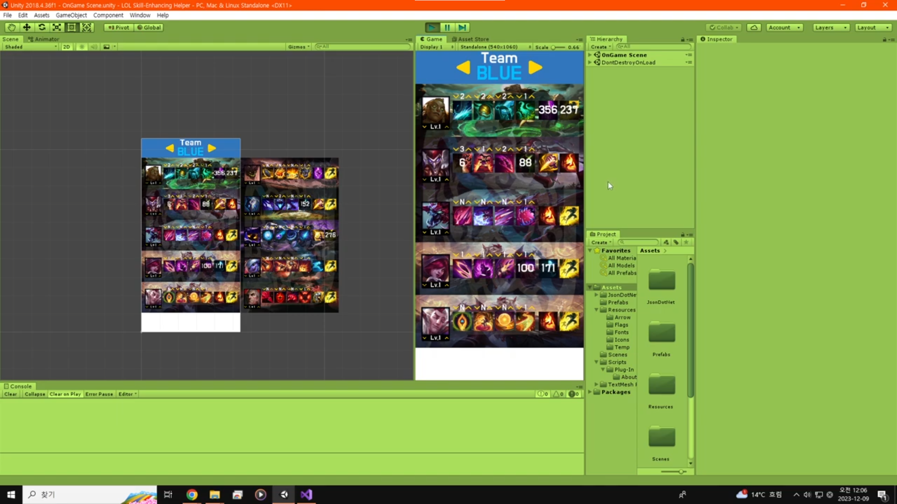

# LOL-cooldown-calculator-public
## Description(ko-kr)
### 승리를 위한 설계의 중요한 요소, 쿨타임

리그 오브 레전드 게임에서 승리를 하기 위해서는 **CC기**라고 불리는 군중 제어기를 잘 활용하고 잘 회피해야 한다. 스킬을 다시 사용할 수 있는 재사용 대기 시간을 **쿨타임(cooldown)**이라고 부르는데, 프로 단계에서는 초 단위로 핵심 스킬 쿨타임을 계산한다.

### 상대의 핵심 스킬과 나의 핵심 스킬 쿨타임 파악하기

이 앱을 이용해 아군의 스킬 쿨타임과 적군의 스킬 쿨타임을 간편하게 기록하고 대비할 수 있다. 이를 이용해 상대의 빈틈을 체계적으로 공략해보자.

### 사용자 친화적 디자인

앱의 UI 구조를 실제 리그 오브 레전드의 점수판 구조와 동일하게 구현했다. 이를 통해 유저가 앱을 조작하느라 새로 사용법을 익힐 필요가 없도록 했으며, 실질적인 활용도 또한 증가시켰다.

## Description(en-us)
### Key Element of Winning Strategy: Cooldowns

In the game League of Legends, utilizing and avoiding crowd control abilities, known as **CC**, is crucial for victory. The cooldown time before a skill can be used again is referred to as **cooldown**. At the professional level, players calculate the cooldowns of key skills down to the second.

### Tracking Key Skill Cooldowns for Both Teams

This app allows you to easily track the cooldowns of both your team's and the enemy's key skills. Use this information to systematically exploit your opponent's vulnerabilities.

### User-Friendly Design

The app's UI is designed to mirror the scoreboard structure of League of Legends. This ensures that users do not need to learn new controls and increases the app's practical utility.

## 기획
### 기획 의도(Planning intent)

### Flow Chart
- 추후 추가 예정

## 기술 스택(Tech Stack)

## 주요 테크닉
### Unity 클라이언트

## 시연 영상

# License
## 사용 조건

이 저장소는 개인 포트폴리오 목적으로 제작되었습니다. 링크를 통해 접근 가능한 사용자들은 코드를 볼 수 있지만, 무단 복제, 수정, 배포는 금지됩니다. 사용에 관한 문의는 [captever6@gmail.com]으로 연락 주시기 바랍니다.

## 사용된 API 및 라이브러리

- Riot Games API: [Riot Developer Portal](https://developer.riotgames.com/)의 이용 약관을 준수합니다.
- Unity: [Unity Terms of Service](https://unity3d.com/legal/terms-of-service)

© Captever 2024. All Rights Reserved.